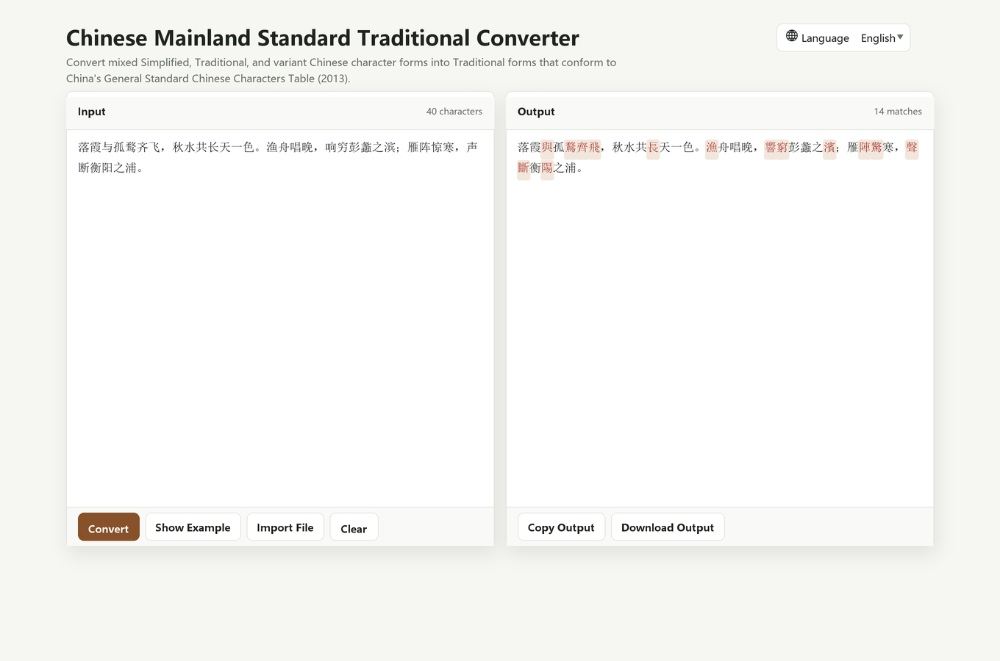

# Chinese Mainland Standard Traditional Converter

[English](README.md) | [简体中文](README.zh-CN.md) | [繁體中文](README.zh-TW.md)

A fully offline browser-based converter for Chinese Mainland standard Traditional character forms. It converts mixed Simplified Chinese, Traditional Chinese, and variant character forms into Traditional forms that conform to China's General Standard Chinese Characters Table (2013).

## Live Demo

GitHub Pages:

https://fionviber.github.io/XiaoHammerChineseConverter/

## Screenshot

## Features

- Convert mixed Simplified, Traditional, and variant Chinese text into Chinese Mainland standard Traditional forms
- Use an OpenCC-style deterministic pipeline: phrase dictionaries first, character dictionaries as fallback
- Import plain text files
- Copy converted output when clipboard access is available
- Download converted output as a UTF-8 text file
- Auto-detect English, Simplified Chinese, and Traditional Chinese from the browser language
- Allow manual language switching with a saved local preference
- Show lightweight action feedback for conversion, example loading, clearing, copying, and downloading
- Run fully offline after the page and dictionary data are available locally

## Usage

Download the repository and open `index.html` in a modern browser.

You can also host the repository as a static site. No build step is required.

## Privacy

Conversion happens in the browser. The page does not upload your text to a server, and the core converter does not require a backend, account, CDN, or network request.

## Credits

Dictionary data is derived from [TerryTian-tech/OpenCC-Traditional-Chinese-characters-according-to-Chinese-government-standards](https://github.com/TerryTian-tech/OpenCC-Traditional-Chinese-characters-according-to-Chinese-government-standards).

See [THIRD_PARTY_NOTICES.md](THIRD_PARTY_NOTICES.md) and the license copy in [licenses/](licenses/) for upstream dictionary notices.

## Disclaimer

This project is provided "as is", without warranty of any kind. Character conversion can involve ambiguous linguistic choices, so important publication, legal, archival, or academic use should still be reviewed manually.

## License

This project's original code and documentation are licensed under the [Zero-Clause BSD License](LICENSE) (`0BSD`).

Bundled third-party dictionary data remains under its original Apache-2.0 license.
