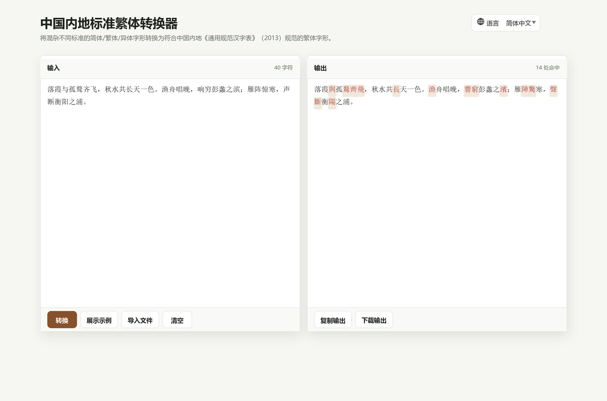

# 中国内地标准繁体转换器

[English](README.md) | [简体中文](README.zh-CN.md) | [繁體中文](README.zh-TW.md)

一个纯前端、纯离线的中国内地标准繁体字形转换工具。它可以将混杂不同标准的简体、繁体、异体字形转换为符合中国内地《通用规范汉字表》（2013）规范的繁体字形。

## 在线演示

GitHub Pages:

https://fionviber.github.io/XiaoHammerChineseConverter/

## 截图

## 功能

- 将简体、繁体、异体字形混杂文本转换为中国内地标准繁体
- 采用 OpenCC 风格的确定性转换逻辑：短语词典优先，单字词典兜底
- 导入纯文本文件
- 在浏览器允许剪贴板访问时复制转换结果
- 将转换结果下载为 UTF-8 文本文件
- 根据浏览器语言自动识别 English、简体中文、繁體中文
- 支持手动切换语言，并保存本地偏好
- 为转换、展示示例、清空、复制、下载提供轻量提示
- 页面和字典数据可用后可完全离线运行

## 使用方式

下载仓库后，用现代浏览器打开 `index.html`。

也可以把仓库作为静态网站托管。无需构建步骤。

## 隐私

转换在浏览器本地完成。页面不会把文本上传到服务器，核心转换器也不需要后端、账号、CDN 或网络请求。

## 致谢

字表数据来自 [TerryTian-tech/OpenCC-Traditional-Chinese-characters-according-to-Chinese-government-standards](https://github.com/TerryTian-tech/OpenCC-Traditional-Chinese-characters-according-to-Chinese-government-standards)。

上游字表说明见 [THIRD_PARTY_NOTICES.md](THIRD_PARTY_NOTICES.md)，许可证副本见 [licenses/](licenses/)。

## 免责声明

本项目按“现状”提供，不作任何形式的保证。繁简/异体字形转换可能涉及歧义；用于出版、法律、档案、学术等重要场景时，仍建议人工校对。

## 许可证

本项目原创代码和文档使用 [Zero-Clause BSD License](LICENSE)（`0BSD`）。

内置的第三方字表数据继续遵循其原始 Apache-2.0 许可证。
