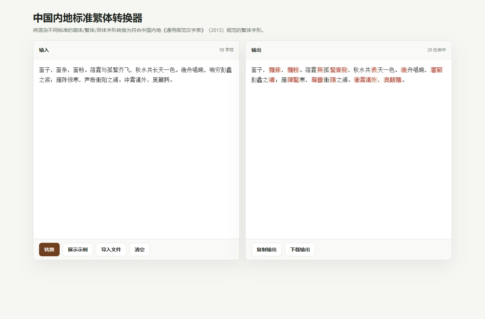

<p align="right">
  <strong>Multi-language:</strong>
  <a href="./README.md">English</a> | 简体中文
</p>

# 中国内地标准繁体转换器

一个纯前端、纯离线的中国内地标准繁体字形转换工具。

它可以将混杂不同标准的简体、繁体、异体字形转换为符合中国内地《通用规范汉字表》（2013）规范的繁体字形。工具完全在浏览器本地运行，不会上传文本到服务器。



## 功能

- 将简体、繁体、异体字形混杂文本转换为中国内地标准繁体。
- 采用 OpenCC 风格的确定性转换逻辑：短语词典优先，单字词典兜底。
- 下载后可纯离线使用。
- 不需要服务器、账号、CDN、构建步骤或依赖安装。
- 根据浏览器语言自动切换界面：任意 `zh` 语言环境显示中文，其他语言显示英文。
- 支持导入文本文件、复制输出、下载输出。

## 在线使用

开启 GitHub Pages 后，在线版本会发布在：

```text
https://<your-github-username>.github.io/mainland-standard-traditional-chinese-converter/
```

## 离线使用

下载 Release ZIP，解压后用浏览器打开 `index.html` 即可。

工具只引用本地文件：

```text
index.html
app.js
vendor/t2gov-data.js
```

## 转换流程

转换器用原生 JavaScript 实现，并遵循上游 OpenCC 配置结构：

```text
CJK 兼容汉字归一化
-> s2t：STPhrases.txt 优先，STCharacters.txt 兜底
-> CJK 兼容汉字归一化
-> t2gov：TGPhrases.txt 优先，TGCharacters.txt 兜底
```

字表数据已经打包到 `vendor/t2gov-data.js`，浏览器可以直接本地运行。

## 数据来源

字表数据来自：

```text
TerryTian-tech/OpenCC-Traditional-Chinese-characters-according-to-Chinese-government-standards
```

仓库：

https://github.com/TerryTian-tech/OpenCC-Traditional-Chinese-characters-according-to-Chinese-government-standards

上游字表使用 Apache License 2.0。详见 `THIRD_PARTY_NOTICES.md` 和 `licenses/` 中的许可证副本。

## 免责声明

本项目按“现状”提供，不作任何形式的保证。繁简/异体字形转换可能涉及歧义；用于出版、法律、档案、学术等重要场景时，仍建议人工校对。

## 许可证

本项目原创代码和文档使用 Zero-Clause BSD License（`0BSD`）。

内置的第三方字表数据继续遵循其原始 Apache-2.0 许可证。
