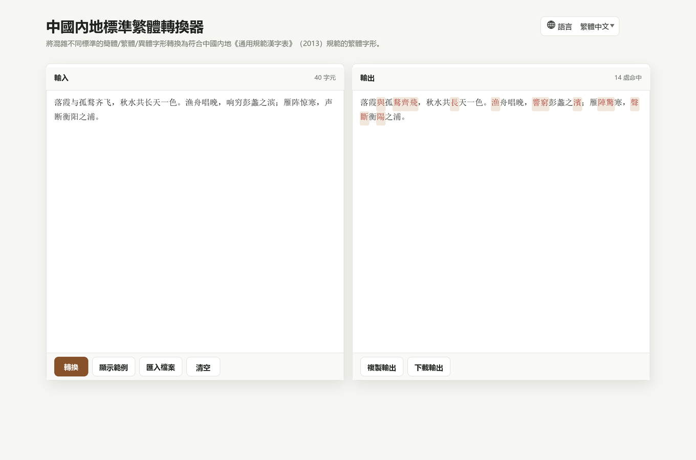

# 中國內地標準繁體轉換器

[English](README.md) | [简体中文](README.zh-CN.md) | [繁體中文](README.zh-TW.md)

一個純前端、純離線的中國內地標準繁體字形轉換工具。它可以將混雜不同標準的簡體、繁體、異體字形轉換為符合中國內地《通用規範漢字表》（2013）規範的繁體字形。

## 線上演示

GitHub Pages:

https://fionviber.github.io/XiaoHammerChineseConverter/

## 截圖

## 功能

- 將簡體、繁體、異體字形混雜文字轉換為中國內地標準繁體
- 採用 OpenCC 風格的確定性轉換邏輯：短語詞典優先，單字詞典兜底
- 匯入純文字檔案
- 在瀏覽器允許剪貼簿存取時複製轉換結果
- 將轉換結果下載為 UTF-8 文字檔案
- 根據瀏覽器語言自動識別 English、简体中文、繁體中文
- 支援手動切換語言，並保存本地偏好
- 為轉換、顯示範例、清空、複製、下載提供輕量提示
- 頁面和字典資料可用後可完全離線運行

## 使用方式

下載倉庫後，用現代瀏覽器打開 `index.html`。

也可以把倉庫作為靜態網站托管。無需構建步驟。

## 隱私

轉換在瀏覽器本地完成。頁面不會把文字上傳到伺服器，核心轉換器也不需要後端、帳號、CDN 或網路請求。

## 致謝

字表資料來自 [TerryTian-tech/OpenCC-Traditional-Chinese-characters-according-to-Chinese-government-standards](https://github.com/TerryTian-tech/OpenCC-Traditional-Chinese-characters-according-to-Chinese-government-standards)。

上游字表說明見 [THIRD_PARTY_NOTICES.md](THIRD_PARTY_NOTICES.md)，授權副本見 [licenses/](licenses/)。

## 免責聲明

本專案按「現狀」提供，不作任何形式的保證。繁簡/異體字形轉換可能涉及歧義；用於出版、法律、檔案、學術等重要場景時，仍建議人工校對。

## 授權條款

本專案原創程式碼和文件使用 [Zero-Clause BSD License](LICENSE)（`0BSD`）。

內置的第三方字表資料繼續遵循其原始 Apache-2.0 授權。
